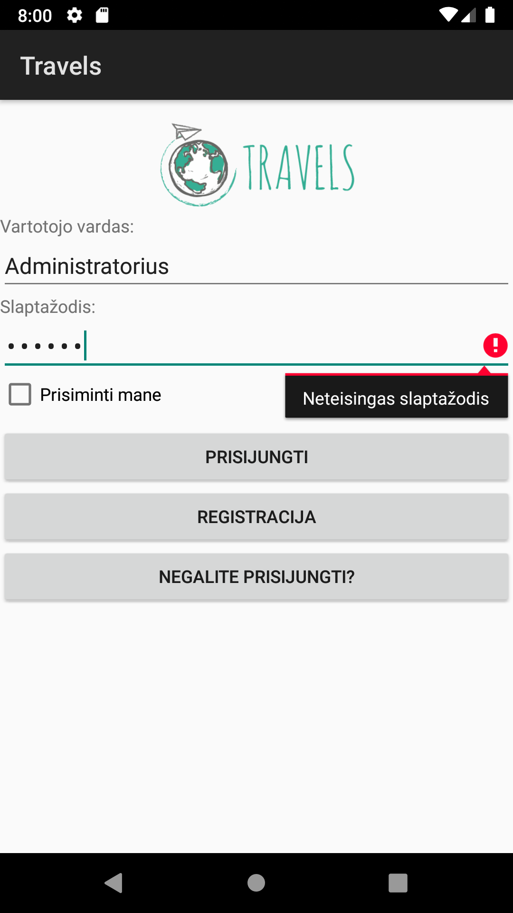
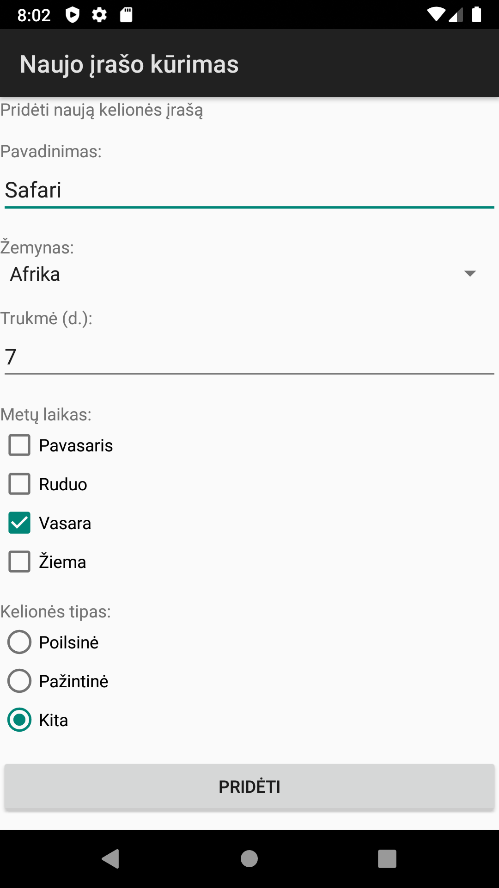

# Travels - Android JAVA

<table>
<tr>
<td>
This is my first Android and JAVA learning project. It's a continuation of my previous project (https://github.com/pocketful/Travels-PHP-CRUD-Search) and that website's mobile app. The database and the main functionalities are the same.
</td>
</tr>
</table>

## Technologies Used

* JAVA
* XML
* JSON
* PHP 5.3.3
* MySQL 3.5
* Android Studio

## Features

* Create a new entry
* Login
* Register
* Remember me
* Validation
* Search (coming up)
* GUI

## Demo

Login by registering your own user or use one of the following ones:

* `Administratorius`
* `Valdytojas`
* `Vartotojas`

The password is the same for all those accounts: `demo`  

## Setup

* Be aware that this project uses older technologies versions.
* Change credentials in `mobile/dbConnect.php` file.
* All the tables needed are written in the file `db.sql`. You can look at the file and create each table manually or you can just run the file with MySQL and it will create all the necessary tables automatically.
* Upload `mobile` folder (PHP files) on a host.
* Open the rest of the project with Android Studio and find and replace all `byethost` credentials.

## Sources
This app is based on [my previous website](https://github.com/pocketful/Travels-PHP-CRUD-Search).

 

[:arrow_up_small: **Back To Top**](#top)